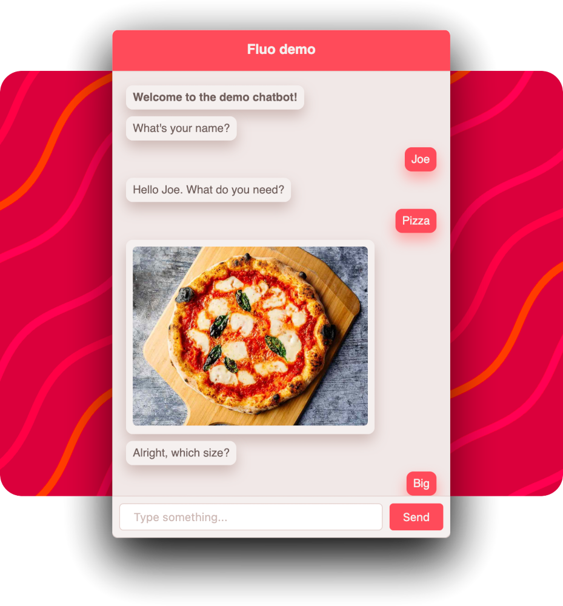

<p align="center">
 
</p>


# Fluo

Client side chat bot that you can embed in your page. Useful as simple assistant.

See [live demo](https://drowned.ch/fluo).

## Features

- Messages with text or picture
- Text or buttons based prompts
- Data retention through conversation
- Conditions & switches

## Building

```sh
npm install
npm run prod
```

## Example

Build Fluo then open [test/index.html]([test/index.html) in your browser.

## Usage

Please refer to [USAGE](doc/USAGE.md).

## License

Please refer to [LICENSE](LICENSE).